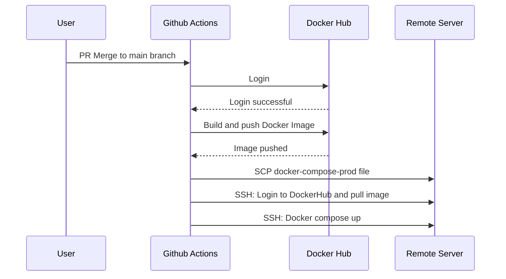

# LigiPredictor (wip)

## Table of Contents

1. [Introduction](#introduction)
2. [Architecture](#architecture)
3. [Tech Stack](#tech-stack)
4. [Getting Started](#getting-started)
5. [Project Structure](#project-structure)
6. [API Routes](#api-routes)
7. [Scheduled Jobs](#scheduled-jobs)
8. [Deployment Process](#deployment-process)
9. [Domain Knowledge](#domain-knowledge)
10. [Scoring System](#scoring-system)

## Introduction

**LigiPredictor** is a football prediction application where users forecast match scores to earn points and track their rank on a dynamic leaderboard. The platform is designed with two primary user roles: an **Admin** for tournament management and a **Predictor** for submitting predictions. The system automates key functions—such as fetching **scheduled and live match data**, scoring predictions, and updating rankings—through a series of **scheduled jobs and events**.

For more on how to play and earn points jump to [Domain Knowledge](#domain-knowledge) and [Scoring System](#scoring-system)

## Architecture

### Backend

**RESTful API** built using **Express.js** and structured with a **Clean Architecture** pattern. Business logic is encapsulated in **Interactors**. **Batch processing** is managed using **node-schedule** for timed jobs and event triggers for immediate tasks. **Workflow and data orchestration** are handled with **RxJS** to manage complex, asynchronous data flows.

### Frontend

**React** app built on a **headless architecture**, where business logic is decoupled from the UI using **hooks, components, and providers**. The current implementation uses **Material-UI** but the architecture allows for a seamless transition to other CSS frameworks like **Tailwind CSS** or **Shadcn UI**.

## Tech Stack

### Frontend

- **Framework**: React 19+ with TypeScript 5
- **Build Tool**: Vite
- **Styling**: Material Ui with custom components
- **State Management**: React Query + Context API

### Backend

- **Runtime**: Node.js 22+ with TypeScript 5
- **Database**: MongoDb
- **Authentication**: JWT
- **Workflow**: Reactive Extensions
- **API**: RESTful API with Express.js
- **Web Server**: Nginx + LetsEncrypt

### DevOps & Tools

- **Testing**: Mocha, Sinon Chai, Jest, RTL
- **Linting**: ESLint + Prettier
- **Containerization**: Docker
- **CI/CD**: GitHub Actions ready
- **Git**: Husky, CommitLint, Lint-staged

## Getting Started

### 📋 Prerequisites

- Node.js (v22 or higher)
- npm
- MongoDb (local or cloud)
- Git
- Docker (Optional but recommended)

### 1. Clone the Repository

```bash
git clone git@github.com:ckagiri/predictor.git
cd predictor
```

## A. Manual Setup

### 2. Install Dependencies

```bash
# Install backend dependencies
cd backend
npm install

# Install frontend dependencies
cd frontend
npm install
```

### 3. Environment Configuration

Copy or create `.env` file in the backend directory

```bash
cp config/dev.env.example backend/.env.dev
```

**_Database Setup In .env_**

- Option A: Local Mongodb
  - local_mongo
  - MONGO_URI
- Option B: Atlas
  - cloud_mongo
  - CLOUD_MONGO_URI

### 4. Database seed & import

Seed current premier-league season and import its matches from external api.

```bash
cd backend
npm run seed-defaults:dev
npm run import:dev
```

### 5. Start Development Servers

For backend server, two options available

- using node directly
- using tsx (typescript-execute)

```bash
# Start server (from backend directory)
npm run start:tsx:dev
# alternative
# npm run build && npm run start:dev

# Start client (in a new terminal, from frontend directory)
npm run dev
```

## B. Docker Setup

### 2. Environment Configuration

Create a `dev.env` file in config folder. See `dev.env.example` in same folder and update values as needed.

```bash
API_FOOTBALL_DATA_KEY=
PORT=3110
DATA_OPTION=local_mongo
MONGO_HOSTNAME=127.0.0.1
MONGO_PORT=27017
MONGO_DB=ligipredictor_test
MONGO_USERNAME=
MONGO_PASSWORD=
MONGO_URI="mongodb://${MONGO_USERNAME}:${MONGO_PASSWORD}@${MONGO_HOSTNAME}:${MONGO_PORT}/${MONGO_DB}?authSource=admin"
```

### 3. Start Development Servers

From root directory

```bash
make compose-dev-build
make compose-dev-up
```

### 4. Database import

dev db is automatically seeded with current premier-league season but it is the reference data not matches.

```bash
cp config/dev.env backend/.env.dev
# update MONGO_PORT to 27070 (to match docker-compose.dev.yml)
cd backend
npm run import:dev
```

## Access the Application

- Frontend: [http://localhost:8040](http://localhost:3000)
- Backend API: [http://localhost:3110](http://localhost:3001)

## 🧪 Available Scripts

### Backend Directory

```bash
npm run typecheck           # Run typechecking
npm run tests               # Run all unit tests
npm run test:integration    # Run internal & external api tests
npm run seed-testdata       # Run dummy data - it includes predictions & leaderboards
npm run lint                # Run ESLint
npm run format              # Run Prettier
```

### Frontend Directory

```bash
npm run dev                 # Start Vite dev server
npm run build               # Build for production
npm run preview             # Preview production build
npm run test                # Run frontend tests
```

## Project Structure

```
LigiPredictor/
├── Backend/
│   ├── src/
│   │   ├── __tests__/
│   │   ├── app/
│   │   │   ├── api/
│   │   │   │   ├── auth/
│   │   │   │   ├── contests/
│   │   │   │   ├── data/
│   │   │   │   └── routes.ts
│   │   │   │   └── ...
│   │   │   ├── schedulers/
│   │   │   └── server.ts
│   │   ├── common/
│   │   │   └── eventMediator.ts
│   │   │   └── ...
│   │   ├── db/
│   │   │   ├── converters/
│   │   │   ├── models/
│   │   │   ├── repositories/
│   │   │   ├── tasks/
│   │   │   └── ...
│   └── package.json
├── Config/
│   ├── client/
│   │   ├── nginx/
│   │   └── Dockerfile
│   ├── nginx/
│   │   ├── default.conf
│   │   └── Dockerfile
│   ├── server/
│   │   └── Dockerfile
├── Frontend /
│   ├── src/
│   │   ├── admin/
│   │   │   ├── competitions/
│   │   │   ├── layout/
│   │   │   └── ...
│   │   ├── app/
│   │   ├── assets/
│   │   ├── data-simple-rest/
│   │   ├── frame/
│   │   │   ├── core/
│   │   │   ├── routing/
│   │   └── ...
│   │   ├── root/
│   │   ├── ui-materialui/
│   │   └── main.tsx
│   └── package.json
├── docker-compose-*.yml
├── Makefile
└── package.json
```

## API Routes

### [for configuration] /api/competitions

| Path                                                                    | Resource            |
| ----------------------------------------------------------------------- | ------------------- |
| /api/competitions                                                       | Competitions        |
| /api/competitions/{competition}                                         | Competition         |
| /api/competitions/{competition}/seasons                                 | Competition-Seasons |
| /api/competitions/{competition}/seasons/{season}                        | Competition-Season  |
| /api/competitions/{competition}/seasons/{season}/teams                  | Season-Teams        |
| /api/competitions/{competition}/seasons/{season}/rounds                 | Season-Rounds       |
| /api/competitions/{competition}/seasons/{season}/rounds/{round}         | Season-Round        |
| /api/competitions/{competition}/seasons/{season}/rounds/{round}/matches | Round-Matches       |
| /api/competitions/{competition}/seasons/{season}/matches                | Season-Matches      |
| /api/competitions/{competition}/seasons/{season}/matches/{match}        | Season-Match        |

**_Eg (Get Round Matches):_** _/api/competitions/premier-league/seasons/2025-26/rounds/gameweek-1/matches_

### [for gameplay] /api/Contests

| Path                                                    | Action                                                        |
| ------------------------------------------------------- | ------------------------------------------------------------- |
| /api/contests                                           | Get Default-Competition's Current-Round Matches               |
| /api/contests/{competition}                             | Get Competition's Current-Round Matches                       |
| /api/contests/{competition}/matches                     | Get Competition's Current Round Matches                       |
| /api/contests/{competition}/{season}/matches            | Get Season's Last or Current Round Matches                    |
| /api/contests/{competition}/{season}/matches/{match}    | Get Season Match                                              |
| /api/contests/{competition}/{season}/{round}/matches    | Get Round Matches                                             |
| /api/contests/{competition}/{season}/{round}/auto-pick  | Update Round-Match Predictions with random scores where blank |
| /api/contests/{competition}/{season}/{round}/pick-score | Update Round-Match Prediction(s) with score                   |
| /api/contests/{competition}/{season}/{round}/pick-joker | Update Round with Joker selection                             |

**_Eg (Get Round Matches):_** _/api/contests/premier-league/2025-26/gameweek-1/matches_

## Scheduled Jobs

### TodayAndMorrowMatches

**Event**

- Loop: between min 90s (for live matches) and max 6H

**Description:** Queries an external API call to retrieve and update the latest match data for today and tomorrow. It also identifies and updates matches that are currently in progress. This process ensures all match information, such as rescheduled times, is kept up to date.

### CurrentSeasonCurrentRound

**Event**

- Cron: minute 0 every 2H

**Description**: Checks for updates to the current matchday. If a new matchday is detected, it updates the application's current game round accordingly.

### MakePredictions

**Event**

- Loop: after 3H
- currentSeasonCurrentRoundUpdated

**Description:** Iterates through all active predictors for the current season. For any predictor without a submission, it automatically generates a random prediction. These placeholder predictions are not visible to the user and are overwritten as soon as a user's manual prediction is entered.

### PredictionPoints

**Event**

- Cron: minute 15 every H
- liveMatchUpdateFinished, lastliveMatchUpdateFinished

**Description:** Checks for the completion of matches and then calculates and awards the points for each corresponding prediction.

### Leaderboards

**Event**

- Loop: after 6H
- lastLiveMatchUpdate_predictionPointsCalculated

**Description:** Updates the leaderboards by first calculating and updating user scores, and then re-ranks the leaderboard based on these new scores.

## Deployment Process

The deployment process is a continuous integration and continuous delivery (**CI/CD**) pipeline, orchestrated by **GitHub Actions**, and involving **Docker** and a remote **Linux server**.

1.  **Trigger:** The workflow is initiated either by a PR merge to the `main` branch or a manual dispatch from the repo user.
2.  **Authentication:** The GitHub Action authenticates with **DockerHub** using securely stored credentials from **GitHub Action Secrets**.
3.  **Image Build & Push:** The action then builds the Docker image from the application's source code and pushes it to the DockerHub registry.
4.  **Configuration Transfer:** Using **Secure Copy Protocol (SCP)**, the action transfers the necessary deployment files (`docker-compose.prod.yml` and `.env`) to the remote Linux server.
5.  **Deployment:** A secure shell (**SSH**) command is executed on the server, instructing **Docker Compose** to pull the newly updated image from DockerHub and restart the application.



## Domain Knowledge

- Nine major entities for GamePlay

### 1. Competition

- Represents a footbal tournament.
- It consists of **Season**s which hold a number of scheduled or finished games named **Match**.
- A certain number of **Team**s participate in one particular Season of a Competion.
- The default competition is premier-league. _[note]_ Currently it is the only competitition.

### 2. Season

- Represents a period of time, typically spanning weeks, during which competition matches are played.
- A season cannot last more than a year.
- A season has **Team**s and comprises of **GameRound**s

### 3. Team

- Represents an organisation of people that participates in one particular **Season** of a **Competition**
- Each Season needs to have teams for it to have **Match**es. _[note]_ When a team belongs to a Season it is refered to as a **SeasonTeam**
- Each team has a name, a short name and an optional list of aliases. It also has an official three-letter-acronym. _[note]_ Man-Utd example

```
name: Manchester United
short-name: Man United
aliases: [Man Utd]
tla: MUN
```

### 4. GameRound (aka Round)

- A GameRound is an element of **Season** and represents a grouping of **Match**es.
- It has a position which is an ordinal number.
- If you have played fantasy premier league, a GameRound is the same as Gameweek. At the beginning of the season each match is assigned a matchday and a round. The matchday stays intact throughout the season but the round can change due to rescheduling.
- It is possible for a team to have two matches in one GameRound or none at all.

### 5. Match

- Reflects a scheduled or finished football game. Each match has a kickoff date-time.
- It belongs to a season, played on a certain matchday and grouped in a **GameRound**.
- A match belongs to one and only one GameRound.
- Each season-team typically plays one match per GameRound but there are exceptions to this rule. Certain matches can be rescheduled due to cup competitions, fixture congestion, postponements or other reasons. These matches may need to be moved out of the original GameRound and placed in another.

### 6. Predictor (aka User)

- A user who predicts match results.
- A unique username is used for identification. _[note]_ Currently only username and password are required for registration and login - this is subject to change.
- A predictor predicts the final score of a match and earns points based on the accuracy. _[note]_ [See scoring system](#scoring-system) and examples.

### 7. Prediction

- Represents a final-score prediction entered for a match. It also holds the points awarded.
- Points are calculated once a match ends.
- A prediction can be changed as many times as a user wants before kickoff. After kickoff it is locked.
- Once a predictor enters a season competition, from that point onwards, till the season ends, they cannot have a blank prediction. Either
  - they entered a match-prediction
  - one was autogenerated randomly (between 0-0 and 4-3 or 3-4) by the system.
- An auto-generated prediction is hidden by default and becomes visible once the match has kicked off. Any prediction manually entered by the user will overwrite the auto-generated one and is immediately visible.
- For each **GameRound** a predictor is allowed one and only one **joker** prediction.
  - If correct, the joker will double the points earned for the match.
  - :smiley: A joker is usually placed on the prediction that a predictor is most confident about.
- If a joker has not been entered for the current round, one will be automatically generated. This auto-generated joker remains hidden from the user until its associated match has kicked off, at which point it becomes visible.
- A predictor can change the the round joker as many times as they want but once the joker-match kicks off they cannot pick another round joker.

### 8. Leaderboard

- Represents a ranked listing of users in a competition.
- From a leaderboard the user can see where they stand in comparison to other players.
- _[note]_ Currently all Leaderboards are Global and one of two types - Global-Round or Global-Season
- Global refers to the total set of users competiting in a particular season tournament. All Global-\* boards are public by default and can be viewed by anyone.
- For each active season or round there is one corresponding Global-Season or Global-Round Leaderboard respectively.

### 9. UserScore

- Represents the cumulative total scores of a predictor's **GameRound** or **Season** predictions in RankedOrder.
- Each UserScore belongs to one and only one **Leaderboard**.
- Alternatively, it represents the position of a predictor within a Leaderboard. It holds a new and previous position of the predictor, based on the scores.
- The scores are ordered by
  - i) total points (highest first) then by
  - ii) most correct outcomes
  - iii) most correct scores
  - iv) most correct goal-differences and finally
  - v) most close scores

## Scoring System

### How To Score

|                           |          |
| ------------------------- | -------- |
| Correct Outcome           | +7       |
| Correct Score             | +10      |
| Correct Goal Difference   | +1       |
| Correct Goals (home team) | +1       |
| Correct Goals (away team) | +1       |
| Correct Goals (bonus)     | +1       |
| Close Score               | +1 or +2 |
| Correct joker             | x2       |

### Clarifications

- Correct outcome means correctly picking out the winner or draw

- Close Score +2
  - correct winner & 1 goal from actual score
  - correct draw outcome & 1 goal from both teams to actual score
- Close Score +1
  - correct winner & 1 goal from both teams to actual score
  - wrong outcome but 1 goal from actual score
- Correct-Goals bonus
  - correct winner, correct 3 or more goal difference, not actual score, not 1 goal to actual score

### Fun facts

- The scoring system is additive/cumulative.
- For each prediction the max number of points is 20.
- For each prediction the next possible number of points is 10.
- For correctly predicting the winner, the least number of points is 7.
- For correctly predicting a draw, the least number of points is 8.
- For correctly predicting a draw, the possible points are 8, 10 and 20.
- For correctly predicting the winner, the possible points are 7,8,9,10,20.
- For incorrectly predicting the winner or draw, the possible points are 0,1,2.
- There are no negative points. Each point earned is valuable! :wink:
- _[Tip]_ Aim first to correctly predict the outcome - everything else is a bonus.

### Examples

**Final Score: 2-1**

| Final Score | Prediction | Points |
| :---------: | :--------: | :----: |
|     2-1     |    2-1     |   20   |
|     2-1     |    3-1     |   10   |
|     2-1     |    2-0     |   10   |
|     2-1     |    1-0     |   9    |
|     2-1     |    3-0     |   8    |
|     2-1     |    4-0     |   7    |
|     2-1     |    1-1     |   2    |
|     2-1     |    0-1     |   1    |
|     2-1     |    1-2     |   0    |
|     2-1     |    0-0     |   0    |
|     2-1     |    4-3     |   8    |
|     2-1     |    4-1     |   8    |

**Final Score: 1-1**

| Final Score | Prediction | Points |
| :---------: | :--------: | :----: |
|     1-1     |    1-1     |   20   |
|     1-1     |    2-2     |   10   |
|     1-1     |    0-0     |   10   |
|     1-1     |    3-3     |   8    |
|     1-1     |    1-0     |   2    |
|     1-1     |    1-3     |   1    |

**Final Score: 4-1**

| Final Score | Prediction | Points |
| :---------: | :--------: | :----: |
|     4-1     |    4-1     |   20   |
|     4-1     |    4-0     |   10   |
|     4-1     |    5-1     |   10   |
|     4-1     |    3-0     |   10   |
|     4-1     |    3-1     |   10   |
|     4-1     |    5-0     |   9    |
|     4-1     |    6-1     |   9    |
|     4-1     |    6-3     |   9    |
|     4-1     |    6-2     |   8    |
|     4-1     |    2-1     |   8    |
|     4-1     |    2-0     |   7    |
|     4-1     |    1-0     |   7    |
